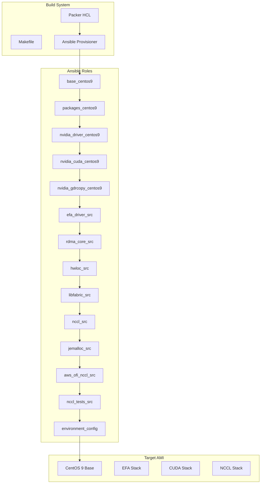

# Design Document: CentOS 9 EFA AMI

## Overview

This design describes the architecture and implementation approach for building a CentOS 9 AMI with a complete EFA stack built from source for ML workloads. The solution uses Packer for AMI creation and Ansible for configuration management, following the established patterns in the existing `1.amazon_machine_image` directory.

The AMI build process follows a layered approach where each component builds upon its dependencies:
1. Base system and development tools
2. NVIDIA drivers and CUDA toolkit
3. GDRCopy for GPU Direct RDMA
4. EFA driver and rdma-core for RDMA support
5. Hwloc for hardware topology
6. Libfabric with EFA and CUDA support
7. NCCL for collective communications
8. Jemalloc for optimized memory allocation
9. AWS OFI NCCL plugin for EFA-NCCL integration
10. NCCL tests for validation

## Architecture



### Directory Structure

```
2.ami_and_containers/centtos9_machine_image/
├── Makefile
├── packer-centos9.pkr.hcl
├── playbook-centos9-gpu.yml
├── inventory/
│   ├── hosts
│   └── group_vars/
│       └── all.yml
└── roles/
    ├── base_centos9/
    │   ├── defaults/main.yml
    │   └── tasks/main.yml
    ├── packages_centos9/
    │   ├── defaults/main.yml
    │   └── tasks/main.yml
    ├── nvidia_driver_centos9/
    │   ├── defaults/main.yml
    │   └── tasks/main.yml
    ├── nvidia_cuda_centos9/
    │   ├── defaults/main.yml
    │   └── tasks/main.yml
    ├── nvidia_gdrcopy_centos9/
    │   ├── defaults/main.yml
    │   └── tasks/main.yml
    ├── efa_driver_src/
    │   ├── defaults/main.yml
    │   └── tasks/main.yml
    ├── rdma_core_src/
    │   ├── defaults/main.yml
    │   └── tasks/main.yml
    ├── hwloc_src/
    │   ├── defaults/main.yml
    │   └── tasks/main.yml
    ├── libfabric_src/
    │   ├── defaults/main.yml
    │   └── tasks/main.yml
    ├── nccl_src/
    │   ├── defaults/main.yml
    │   └── tasks/main.yml
    ├── jemalloc_src/
    │   ├── defaults/main.yml
    │   └── tasks/main.yml
    ├── aws_ofi_nccl_src/
    │   ├── defaults/main.yml
    │   └── tasks/main.yml
    ├── nccl_tests_src/
    │   ├── defaults/main.yml
    │   └── tasks/main.yml
    └── environment_config/
        ├── defaults/main.yml
        ├── tasks/main.yml
        └── templates/
            └── efa-env.sh.j2
```

## Components and Interfaces

### Packer Configuration

The Packer HCL file defines the AMI build configuration:

```hcl
// Key configuration elements
variable "base_ami" {
  type    = string
  default = "ami-04331ec57720ee626"
}

variable "aws_region" {
  type    = string
  default = "us-east-1"
}

variable "ssh_username" {
  type    = string
  default = "ec2-user"  // CentOS 9 uses ec2-user on AWS
}

source "amazon-ebs" "centos9-efa" {
  source_ami    = var.base_ami
  instance_type = "g5.16xlarge"  // GPU instance for driver installation
  ssh_username  = var.ssh_username
  // 100GB disk for build artifacts
  launch_block_device_mappings {
    volume_size = 100
    volume_type = "gp3"
  }
}
```

### Ansible Role Interfaces

Each role follows a consistent interface pattern:

```yaml
# defaults/main.yml - Configurable variables
component_version: "x.y.z"
component_repo: "https://github.com/..."
component_prefix: "/opt/component"
component_build_dir: "/tmp/component"

# tasks/main.yml - Implementation
# 1. Install dependencies
# 2. Clone/download source
# 3. Configure build
# 4. Build from source
# 5. Install
# 6. Configure environment
```

### Component Dependencies

| Component | Depends On | Provides |
|-----------|------------|----------|
| base_centos9 | - | System configuration |
| packages_centos9 | base_centos9 | Development tools |
| nvidia_driver_centos9 | packages_centos9 | GPU drivers |
| nvidia_cuda_centos9 | nvidia_driver_centos9 | CUDA toolkit |
| nvidia_gdrcopy_centos9 | nvidia_cuda_centos9 | GDRCopy libraries |
| efa_driver_src | packages_centos9 | EFA kernel module |
| rdma_core_src | efa_driver_src | libibverbs, librdmacm |
| hwloc_src | packages_centos9 | Hardware topology |
| libfabric_src | rdma_core_src, nvidia_gdrcopy_centos9 | libfabric with EFA |
| nccl_src | nvidia_cuda_centos9 | NCCL libraries |
| jemalloc_src | packages_centos9 | Static jemalloc |
| aws_ofi_nccl_src | libfabric_src, nccl_src, jemalloc_src | NCCL-EFA plugin |
| nccl_tests_src | aws_ofi_nccl_src | Test binaries |
| environment_config | all | Environment setup |

### Key Build Configurations

#### Libfabric Configuration

```bash
./configure \
  --prefix=/opt/amazon/efa \
  --with-cuda='/usr/local/cuda' \
  --enable-cuda-dlopen \
  --with-gdrcopy=/usr/local/gdrcopy \
  --enable-gdrcopy-dlopen \
  --enable-efa \
  --disable-verbs \
  --disable-psm3 \
  --disable-opx \
  --disable-usnic \
  --disable-rstream

# Build with specific providers
make PROVIDERS_TO_BUILD='verbs efa rxd shm sm2 lpp perf trace monitor hook_debug hook_hmem dmabuf_peer_mem'
```

#### NCCL Build Configuration

```bash
make -j src.build \
  CUDA_HOME=/usr/local/cuda \
  NVCC_GENCODE='-gencode=arch=compute_70,code=sm_70 \
                -gencode=arch=compute_75,code=sm_75 \
                -gencode=arch=compute_80,code=sm_80 \
                -gencode=arch=compute_90,code=sm_90'
```

#### AWS OFI NCCL with Static Jemalloc

```bash
./configure \
  --prefix=/opt/aws-ofi-nccl \
  --with-libfabric=/opt/amazon/efa \
  --with-nccl=/opt/nccl/build \
  --with-cuda=/usr/local/cuda \
  LDFLAGS="-L/opt/jemalloc/lib -Wl,-Bstatic -ljemalloc -Wl,-Bdynamic"
```

#### NCCL Tests with Static NCCL

```bash
make MPI=1 \
  CUDA_HOME=/usr/local/cuda \
  MPI_HOME=/opt/amazon/openmpi \
  NCCL_HOME=/opt/nccl/build \
  NCCL_LIB_DIR=/opt/nccl/build/lib \
  STATIC_NCCL=1
```

## Data Models

### Ansible Variable Structure

```yaml
# group_vars/all.yml
---
# Base configuration
work_dir: /tmp
install_prefix: /opt

# Version pinning
efa_driver_branch: "master"
rdma_core_version: "v52.0"
libfabric_version: "v2.4.0"
hwloc_version: "2.10.0"
nccl_version: "v2.28.3-1"
jemalloc_version: "5.3.0"
aws_ofi_nccl_version: "master"
nccl_tests_commit: "9a5c15461abcef145b907c54d04aea4e8d1cb21f"

# CUDA configuration
cuda_version: "12-4"
cuda_home: "/usr/local/cuda"

# Installation paths
efa_prefix: "/opt/amazon/efa"
nccl_prefix: "/opt/nccl"
gdrcopy_prefix: "/usr/local/gdrcopy"
hwloc_prefix: "/opt/hwloc"
jemalloc_prefix: "/opt/jemalloc"
aws_ofi_nccl_prefix: "/opt/aws-ofi-nccl"
nccl_tests_prefix: "/opt/nccl-tests"

# Libfabric providers
libfabric_providers: "verbs efa rxd shm sm2 lpp perf trace monitor hook_debug hook_hmem dmabuf_peer_mem"

# NCCL compute capabilities
nccl_gencode: "-gencode=arch=compute_70,code=sm_70 -gencode=arch=compute_75,code=sm_75 -gencode=arch=compute_80,code=sm_80 -gencode=arch=compute_90,code=sm_90"
```

### Environment Configuration Template

```bash
# /etc/profile.d/efa-stack.sh
# EFA Stack Environment Configuration

# CUDA
export CUDA_HOME=/usr/local/cuda
export PATH=$CUDA_HOME/bin:$PATH
export LD_LIBRARY_PATH=$CUDA_HOME/lib64:$CUDA_HOME/extras/CUPTI/lib64:$LD_LIBRARY_PATH
export CPATH=$CUDA_HOME/targets/x86_64-linux/include:$CPATH

# GDRCopy
export PATH=/usr/local/gdrcopy/bin:$PATH
export LD_LIBRARY_PATH=/usr/local/gdrcopy/lib64:$LD_LIBRARY_PATH
export CPATH=/usr/local/gdrcopy/include:$CPATH

# Hwloc
export PATH=/opt/hwloc/bin:$PATH
export LD_LIBRARY_PATH=/opt/hwloc/lib:$LD_LIBRARY_PATH

# EFA/Libfabric
export PATH=/opt/amazon/efa/bin:$PATH
export LD_LIBRARY_PATH=/opt/amazon/efa/lib:$LD_LIBRARY_PATH
export FI_PROVIDER=efa

# NCCL
export LD_LIBRARY_PATH=/opt/nccl/build/lib:$LD_LIBRARY_PATH
export NCCL_PROTO=simple

# AWS OFI NCCL
export LD_LIBRARY_PATH=/opt/aws-ofi-nccl/lib:$LD_LIBRARY_PATH

# NCCL Tests
export PATH=/opt/nccl-tests/build:$PATH
```

### Packer Variables Model

```hcl
variable "ami_name" {
  type        = string
  default     = "centos9-efa-ml"
  description = "Name prefix for the AMI"
}

variable "ami_version" {
  type        = string
  default     = "1.0.0"
  description = "Version string for the AMI"
}

variable "base_ami" {
  type        = string
  default     = "ami-04331ec57720ee626"
  description = "CentOS 9 base AMI ID"
}

variable "aws_region" {
  type        = string
  default     = "us-east-1"
  description = "AWS region for AMI creation"
}

variable "instance_type" {
  type        = string
  default     = "g5.16xlarge"
  description = "Instance type for build (must have GPU)"
}

variable "ssh_username" {
  type        = string
  default     = "ec2-user"
  description = "SSH username for CentOS 9"
}

variable "volume_size" {
  type        = number
  default     = 100
  description = "Root volume size in GB"
}
```


## Correctness Properties

*A property is a characteristic or behavior that should hold true across all valid executions of a system—essentially, a formal statement about what the system should do. Properties serve as the bridge between human-readable specifications and machine-verifiable correctness guarantees.*

Based on the prework analysis, most acceptance criteria for this AMI build system are specific configuration examples rather than universal properties. The testable properties identified are:

### Property 1: Environment Configuration Completeness

*For any* installed component (CUDA, GDRCopy, EFA, libfabric, NCCL, hwloc, aws-ofi-nccl), the environment configuration in /etc/profile.d/ SHALL include the component's library path in LD_LIBRARY_PATH, binary path in PATH (if applicable), and header path in CPATH (if applicable).

**Validates: Requirements 13.2, 13.3, 13.4**

### Property 2: Role Structure Consistency

*For any* Ansible role in the roles/ directory, the role SHALL contain at minimum a `tasks/main.yml` file and optionally a `defaults/main.yml` file for configurable variables.

**Validates: Requirements 14.2, 14.5**

### Property 3: Source Build Configuration Completeness

*For any* component built from source (EFA driver, rdma-core, hwloc, libfabric, NCCL, jemalloc, aws-ofi-nccl, NCCL tests), the Ansible role SHALL include tasks for: (1) cloning/downloading source, (2) configuring build, (3) building, and (4) installing.

**Validates: Requirements 5.1-5.4, 6.1-6.4, 7.1-7.4, 8.1-8.10, 9.1-9.4, 10.1-10.4, 11.1-11.7, 12.1-12.4**

### Property 4: Libfabric Configuration Flag Completeness

*For any* libfabric build, the configure command SHALL include all required flags: --prefix, --with-cuda, --enable-cuda-dlopen, --with-gdrcopy, --enable-gdrcopy-dlopen, --enable-efa, and the disable flags for unused providers.

**Validates: Requirements 8.2-8.9**

## Error Handling

### Build Failure Handling

Each Ansible role that builds from source uses Ansible's built-in error handling:

1. **Task Failure**: Ansible tasks fail immediately on non-zero exit codes, providing the command output as error context
2. **Dependency Checking**: Roles should verify dependencies exist before attempting builds
3. **Idempotency**: Tasks should be idempotent where possible, using `creates:` arguments to skip completed steps

### Error Handling Patterns

```yaml
# Pattern 1: Check for required dependencies
- name: "Verify CUDA is installed"
  ansible.builtin.stat:
    path: /usr/local/cuda/bin/nvcc
  register: cuda_check
  failed_when: not cuda_check.stat.exists

# Pattern 2: Use creates to make tasks idempotent
- name: "Build component"
  ansible.builtin.shell: |
    make -j$(nproc)
  args:
    chdir: "{{ build_dir }}"
    creates: "{{ build_dir }}/build/lib/libcomponent.so"

# Pattern 3: Register and check build results
- name: "Configure libfabric"
  ansible.builtin.shell: |
    ./configure {{ configure_flags }}
  args:
    chdir: "{{ libfabric_src_dir }}"
  register: configure_result
  failed_when: configure_result.rc != 0
```

### Recovery Strategies

1. **Clean Build**: If a build fails, the work directory can be removed and the role re-run
2. **Version Pinning**: All source repositories use specific versions/tags/commits to ensure reproducibility
3. **Logging**: Build output is captured in Ansible logs for debugging

## Testing Strategy

### Dual Testing Approach

This project uses both unit tests (specific examples) and property-based tests (universal properties) for comprehensive coverage.

### Unit Tests (Ansible Molecule)

Unit tests verify specific configurations and examples:

1. **Packer Configuration Tests**
   - Verify base AMI ID is correct
   - Verify region is us-east-1
   - Verify SSH username is ec2-user
   - Verify volume size >= 100GB

2. **Role Configuration Tests**
   - Verify each role has required files (tasks/main.yml)
   - Verify version variables are set correctly
   - Verify repository URLs are correct

3. **Build Configuration Tests**
   - Verify libfabric configure flags include all required options
   - Verify NCCL NVCC_GENCODE includes all compute capabilities
   - Verify aws-ofi-nccl LDFLAGS includes static jemalloc

### Property-Based Tests

Property tests verify universal properties across all components:

1. **Environment Configuration Property Test**
   - Generate list of all installed components
   - For each component, verify its paths are in the environment configuration
   - **Feature: centos9-efa-ami, Property 1: Environment Configuration Completeness**

2. **Role Structure Property Test**
   - Enumerate all roles in roles/ directory
   - For each role, verify required structure exists
   - **Feature: centos9-efa-ami, Property 2: Role Structure Consistency**

3. **Source Build Configuration Property Test**
   - Enumerate all source-build roles
   - For each role, verify all four build phases are present
   - **Feature: centos9-efa-ami, Property 3: Source Build Configuration Completeness**

### Integration Testing

Integration tests run the full Packer build:

1. **AMI Build Test**: Run `make ami_centos9_gpu` and verify AMI is created
2. **AMI Boot Test**: Launch instance from AMI and verify it boots
3. **Component Verification**: SSH to instance and verify all components are accessible

### Test Configuration

```yaml
# molecule/default/molecule.yml
---
dependency:
  name: galaxy
driver:
  name: docker
platforms:
  - name: centos9-test
    image: quay.io/centos/centos:stream9
    privileged: true
provisioner:
  name: ansible
verifier:
  name: ansible
```

### Test Execution

```bash
# Run unit tests with Molecule
cd roles/libfabric_src
molecule test

# Run property tests
python -m pytest tests/test_properties.py -v

# Run full AMI build (integration)
make ami_centos9_gpu
```
